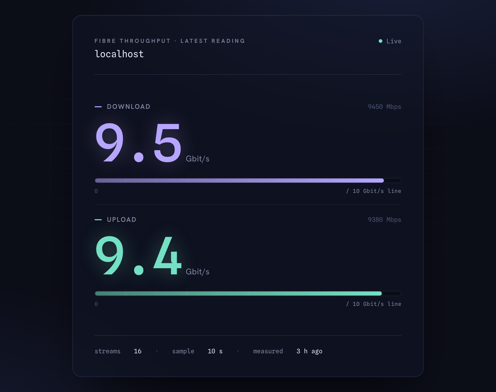

# iperf-speedtest

**A tiny, self-hosted speedtest for fast fiber lines.** It runs [iperf3](https://iperf.fr/)
against a public server (default: [Init7](https://www.init7.net/)), then shows you the
latest download/upload result on a clean dashboard and over a simple JSON API.

On a multi-gigabit line, the usual Ookla-based tools (like
[speedtest-tracker](https://github.com/linuxserver/docker-speedtest-tracker)) often
under-read by a lot. iperf3 with many parallel streams gets much closer to your real line
rate — this wraps it in something you can leave running.



It's one small Python process (standard library only — no pip installs, no database). The
last result is saved to disk, so a good reading stays on screen even if a later test fails
or the container restarts.

---

## Quick start

You'll need Docker. From the project folder:

```sh
docker compose up -d --build
```

Then open **http://localhost:8080/** in your browser. The first test runs on startup, so
the dashboard fills in within a minute or two.

> [!WARNING]
> **Only run this on an unmetered connection.** Init7 offers up to **25 Gbit/s
> symmetric**, and a single test with 16 parallel streams can move several GB. To stay
> kind to the shared test server, the collector runs just **once a day** by default (at a
> random time between 02:00 and 05:00) plus once on startup. You can make tests shorter or
> change the window — see [Configuration](#configuration).

That's it. Everything below is optional.

---

## What you're looking at

The dashboard plots **download** and **upload** on a single shared meter, scaled to a
sensible ceiling for your line (1 → 2.5 → 5 → 10 → 25 Gbit/s). Putting both on the same
scale makes two things obvious at a glance:

- **How close you are to line rate** — how full each bar is.
- **Whether your line is symmetric** — do the two bars match?

It refreshes on its own and keeps the last good reading on screen if the collector is
briefly unreachable. The footer shows how the test was run (parallel streams, sample
length) and when it last measured.

---

## The JSON API

If you'd rather wire the numbers into another tool, every reading is also available as
JSON:

```
GET /api/speedtest/latest
→ {
    "download": 9450.21, "upload": 9380.14,      # Mbps
    "download_gbps": 9.5, "upload_gbps": 9.4,    # Gbps, rounded to 1 decimal
    "timestamp": "2026-06-19T10:30:00+00:00"
  }
```

```sh
curl http://localhost:8080/api/speedtest/latest
```

- `download` / `upload` are in **Mbps**.
- `download_gbps` / `upload_gbps` are the same values in **Gbps**, pre-rounded to one
  decimal — handy for dashboards that can't limit decimal places (e.g. Homepage).
- Before the first test finishes you'll get `503 {}`.

The path deliberately mirrors speedtest-tracker, so it drops into existing tooling
unchanged.

---

## Configuration

Set these as environment variables (e.g. in `docker-compose.yml`). All are optional —
the defaults target Init7.

| Variable | Default | What it does |
| --- | --- | --- |
| `IPERF_HOST` | `speedtest.init7.net` | iperf3 server to test against |
| `IPERF_PORT` | `5202` | iperf3 server port |
| `IPERF_PARALLEL` | `16` | Parallel streams (`-P`). Over the internet each TCP flow is rate-limited, so you need many streams to fill a 10G line (Init7 recommends 16). See [the troubleshooting note](#not-hitting-your-line-rate) about CPU. |
| `IPERF_DURATION` | `10` | Seconds per direction (`-t`). Lower this to use less bandwidth. |
| `IPERF_OMIT` | `2` | Seconds to skip at the start (`-O`) so TCP slow-start isn't averaged in |
| `TZ` | `Europe/Zurich` | Timezone for the schedule window (needs OS tzdata) |
| `DAILY_WINDOW_START_HOUR` | `2` | Earliest local hour for the daily test |
| `DAILY_WINDOW_END_HOUR` | `5` | Latest local hour (exclusive) for the daily test |
| `RUN_ON_START` | `true` | Also run one test on startup, so the dashboard isn't empty after a (re)deploy |
| `HTTP_PORT` | `8080` | Port the dashboard and API listen on |

**How scheduling works:** one test per day at a random time inside your window, plus one
on startup (unless `RUN_ON_START=false`). Download is measured with `iperf3 -R`
(server → you); upload is a normal forward test.

---

## Not hitting your line rate?

If the numbers look low for your connection, the logs tell you why. Each test cycle prints
throughput **and** CPU usage as *cores used / available* (e.g. `1.6/6 cores`):

```sh
docker compose logs -f
```

- **Nearly all cores used** (e.g. `5.5/6 cores`) → you're **CPU-bound**. The line is fine;
  the machine running the test can't go faster. Give it more/faster cores. In a Proxmox VM,
  set the CPU type to `host`. (Don't lower `IPERF_PARALLEL` — you need the streams.)
- **Only a fraction used** (e.g. `1.6/6 cores`) but still slow → the bottleneck is the
  **network path**, not the CPU. In a Proxmox VM this is almost always the single virtio
  NIC queue serializing everything onto one core. Fixes, in order:
  1. VM → Network Device → **Multiqueue = vCPU count** (then reboot, or run
     `ethtool -L <iface> combined <N>` inside the guest).
  2. Set **Firewall = 0** on the NIC if you don't need it (it adds per-packet overhead).
  3. Use an **LXC container** instead of a full VM — it skips the virtio layer entirely.

A low-power CPU (e.g. an i5-8500T at 2.1 GHz) may simply cap a software speedtest below
line rate. That's the measuring machine talking, not your fiber.

---

## Running without Docker (LXC / bare host)

Docker is the recommended setup. But if you'd rather run directly — for example in a
Proxmox LXC, which shares the host kernel and skips a VM's emulated NIC — you can.

> **Heads up:** in practice this usually *doesn't* beat the Docker container. On a fast
> line the ceiling is normally your uplink or the upstream test server, not the local
> virtualization. Also watch the distro's iperf3 version: Debian 12 ships the old
> single-threaded 3.12, which caps multi-stream throughput. The Docker image uses 3.17.

On the Proxmox host, create an unprivileged Debian LXC bound to your bridge, give it
several cores, and start it. Then inside the container:

```sh
apt-get update && apt-get install -y git
git clone https://github.com/philippspinnler/iperf-speedtest /opt/iperf-speedtest
/opt/iperf-speedtest/deploy/install.sh    # installs iperf3 + a systemd service
journalctl -u iperf-speedtest -f          # watch the first test run
```

This serves on port **8089**. To change the port or the Init7 settings, edit
`/etc/systemd/system/iperf-speedtest.service` and run
`systemctl restart iperf-speedtest`. Update later with:

```sh
git -C /opt/iperf-speedtest pull && systemctl restart iperf-speedtest
```

---

## Feeding another dashboard (Homepage, etc.)

To pull these numbers into a separate dashboard, point its speedtest config at this
collector and select the iperf parser:

```
NUXT_SPEEDTEST_SOURCE=iperf
NUXT_SPEEDTESTS_JSON=[{"host":"<collector-host>","port":8080,"provider":"Init7"}]
```

Running natively in an LXC? Use the container's IP and port **8089** instead.
